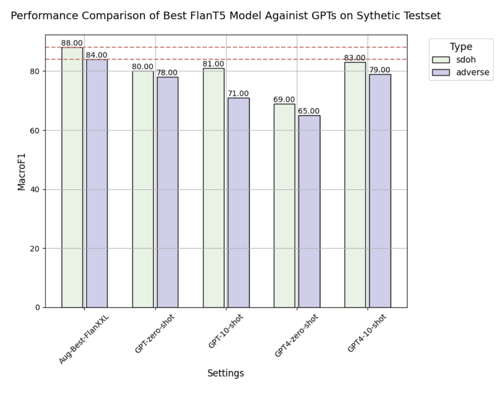
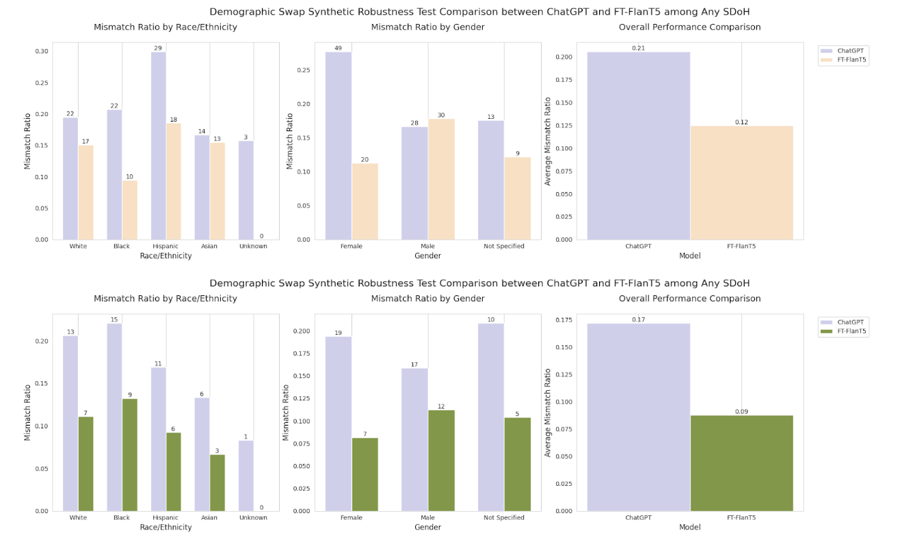
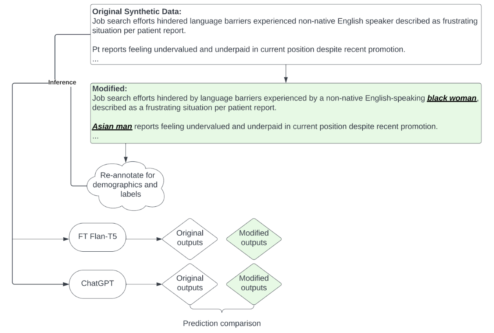

# Large Language Models to Identify Social Determinants of Health in Electronic Health Records

## Main Findings

Our exploration into Social Determinants of Health (SDOH) classification using AI models has led to several insightful findings:

1. Fine-tuned Flan-T5 XL and XXL models exhibit superior performance when compared to the traditional BERT model and various GPT models.
2. The implementation of synthetic data augmentation during the training phase improves model performance and data efficiency.
3. In a test involving synthetic sentences with altered demographic data, the fine-tuned Flan-T5 models consistently outperformed the GPT models in terms of robustness and overall performance.
   
5. We will make the synthetic training and out-of-domain performance+robustness evaluation datasets available to the broader community for further research and development.
   

## Models

Our research involves the application of two primary models for the classification tasks:

1. Model classifying the full label set of SDOH.
2. Model focused on classifying only the adverse SDOH.

And you can find the detailed annotation guideline under `resource`

### BERT

BERT model serves as our baseline in this project. For comparative analysis, we use advanced sequence-to-sequence models. You can find the script for training and evaluation in `bert_train_predict.py`.

### FLAN T5, Base - XXL

Our sequence-to-sequence model, used for the classification tasks, is trained using the FLAN-T5 madel family ranging from base to XXL sizes. The training and prediction scripts are provided in `t5_train.py` and `t5_predict.py`, respectively. The main libraries used for these tasks are `transformers` and `peft`.

## Synthetic Data

Our research uses synthetic data for model training. The synthetic data, available in CSV format, was developed through several iterations with the script under `synthetic_data`:

- Iteration 1: GPT-3.5-turbo was prompted using sentences from the annotation guidelines as references.
- Iteration 2: GPT-3.5-turbo was prompted using sentences from Iteration 1 outputs.

The figure below demostrates the creation process of the sythetic SDoH Human Annotated Demographic Robustness dataset (SHADR) `Partial_Iteration_2_demographic_annotated.csv`.

**If you want to evaluate your model on this,** you should first inference on the ***original sentence***, then use the same model to inference on the ***demographic modified sentences*** for robustness comparisons as shown in the figure below.



- The code and prompts used for synthetic data generation can be found in the Jupyter notebook `synthetic_data_generation_GPT.ipynb`.
- JSON files that contain the prompts fed into GPT 3.5 Turbo.

## Model Comparison

A comparison of model performance on a human-validated subset of synthetic data is demonstrated in the `gpt_vs_ftt5.ipynb` notebook.

## External Links

- arXiv preprint: https://arxiv.org/abs/2308.06354
- A PhysioNet release of our annotated MIMIC-III courpus: https://physionet.org/content/annotation-dataset-sdoh/1.0.0/
- Huggingface dataset version of SHADR: https://huggingface.co/datasets/m720/SHADR

---
How to Cite:
```
@misc{guevara2023large,
      title={Large Language Models to Identify Social Determinants of Health in Electronic Health Records}, 
      author={Marco Guevara and Shan Chen and Spencer Thomas and Tafadzwa L. Chaunzwa and Idalid Franco and Benjamin Kann and Shalini Moningi and Jack Qian and Madeleine Goldstein and Susan Harper and Hugo JWL Aerts and Guergana K. Savova and Raymond H. Mak and Danielle S. Bitterman},
      year={2023},
      eprint={2308.06354},
      archivePrefix={arXiv},
      primaryClass={cs.CL}
}
```
---
For further information or queries, please contact our lab at https://aim.hms.harvard.edu/contact.
